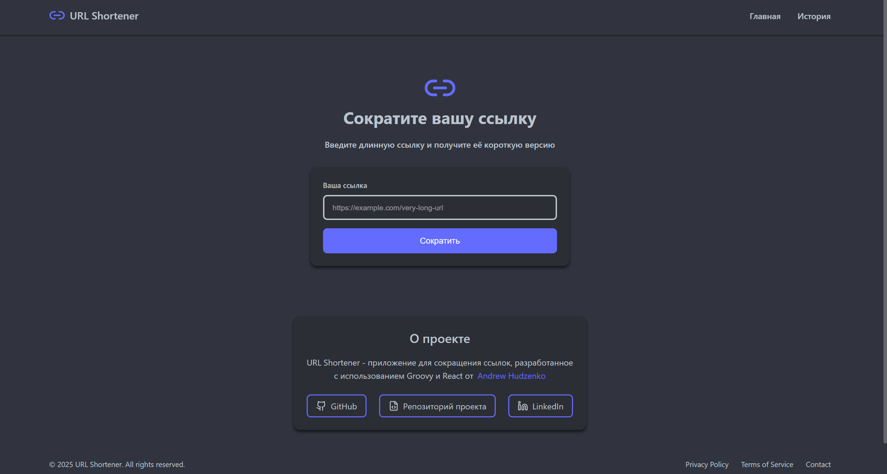

# URL Shortener 🔗

[](https://github.com/andrewhudzen/link-shortener)
[](https://github.com/andrewhudzen/link-shortener)

Full-stack приложение для сокращения длинных URL-адресов в короткие, удобные для использования ссылки.



## 🚀 Особенности

- Мгновенное сокращение длинных URL
- Валидация введенных ссылок
- Копирование сокращенной ссылки в буфер обмена одним кликом
- Адаптивный дизайн для всех устройств

## 🛠 Технологии

### Backend

- Spring Boot 3.2.5
- Groovy
- MongoDB
- Gradle

### Frontend

- React 18
- Vite
- Lucide Icons
- CSS Modules

## 📁 Структура проекта

```plaintext
url-shortener/
├── back-end/        # Spring Boot приложение (API)
└── front-end/       # React приложение (UI)
```

## ⚙️ Установка и запуск

### Предварительные требования

- Java 17 или выше
- Node.js 18 или выше
- MongoDB 4.4 или выше

### Backend

1. Перейдите в директорию back-end:
   ```bash
   cd back-end
    ```
2. Запустите Spring Boot приложение:
   ```bash
   ./gradlew bootRun
   ```

### Frontend

1. Перейдите в директорию front-end:
   ```bash
   cd front-end
   ```
2. Установите зависимости:
   ```bash
    npm install
    ```
3. Запустите React приложение:
    ```bash
    npm run dev
    ```

Приложение будет доступно по адресу http://localhost:5173

## 🔧 API Endpoints

- `POST /shorten` - сокращение URL-адреса
- `GET /:code` - перенаправление на оригинальный URL

## 💻 Разработка

### Конфигурация базы данных

1. Создайте базу данных MongoDB:
2. Обновите параметры подключения в `application.properties`:
    ```properties
    spring.data.mongodb.database=url-shortener
    spring.data.mongodb.uri=mongodb://localhost:27017/url-shortener
    ```

## 👤 Автор

### Andrew Hudzenko

- LinkedIn: https://www.linkedin.com/in/andrew-hudzenko-8942b3251/
- GitHub: https://github.com/andrewhudzenko

## 📝 Лицензия

This project is licensed under the MIT License - see the [LICENSE](LICENSE) file for details.

MIT License

Copyright (c) 2024 Andrew Hudzenko

Permission is hereby granted, free of charge, to any person obtaining a copy
of this software and associated documentation files (the "Software"), to deal
in the Software without restriction, including without limitation the rights
to use, copy, modify, merge, publish, distribute, sublicense, and/or sell
copies of the Software, and to permit persons to whom the Software is
furnished to do so, subject to the following conditions:

The above copyright notice and this permission notice shall be included in all
copies or substantial portions of the Software.

THE SOFTWARE IS PROVIDED "AS IS", WITHOUT WARRANTY OF ANY KIND, EXPRESS OR
IMPLIED, INCLUDING BUT NOT LIMITED TO THE WARRANTIES OF MERCHANTABILITY,
FITNESS FOR A PARTICULAR PURPOSE AND NONINFRINGEMENT. IN NO EVENT SHALL THE
AUTHORS OR COPYRIGHT HOLDERS BE LIABLE FOR ANY CLAIM, DAMAGES OR OTHER
LIABILITY, WHETHER IN AN ACTION OF CONTRACT, TORT OR OTHERWISE, ARISING FROM,
OUT OF OR IN CONNECTION WITH THE SOFTWARE OR THE USE OR OTHER DEALINGS IN THE
SOFTWARE.